## Preliminary functions

The following functions allow us to load and analyze mutational
signatures

    # Loads a mutational signature matrix from a mutational signature txt file
    load_old_mutational_matrix<- 
      function(filename,
              mut.order="mutational_sig_oec/supplied_data/mut_sig.order.csv") {
      mutational.signature <-  read_csv(filename)
      mut_mat <-  read_csv(mut.order)

      mut.join <-  mutational.signature %>%
        inner_join(mut_mat)
      
      order.tri <-  unique(mut.join$ext.context)

      mut.join <-  mut.join %>%
        mutate(ext.context = factor (ext.context, levels = order.tri)) %>%
        select(ext.context,prob)
      
      mut.matrix <-  as.matrix(
            sapply(mut.join[,2:ncol(mut.join)], as.numeric))  

      rownames(mut.matrix) <-  mut.join$ext.context
     
      return (t(mut.matrix)[,1:96])
    }

    change_old_mutational_matrix<-
        function(sig.frame,
                 mut.order="mutational_sig_oec/supplied_data/mut_sig.order.csv") {
            
      mutational.signature <-  sig.frame
      mut_mat <-  read_csv(mut.order)

      mut.join <-  mutational.signature %>%
        inner_join(mut_mat)
      
      order.tri <-  unique(mut.join$ext.context)

      mut.join <-  mut.join %>%
          mutate(ext.context =
                     factor (ext.context, levels = order.tri)) %>%
          select(sample,ext.context,prob) %>%
          pivot_wider(names_from = ext.context,
                      values_from = prob)
        
        mut.matrix <-  as.matrix(
            sapply(mut.join[,2:ncol(mut.join)], as.numeric))  
        rownames(mut.matrix) = mut.join$sample

        return (t(mut.matrix))
    }

    load_cosmic_matrix<- function(mut.order="mutational_sig_oec/supplied_data/mut_sig.order.csv") {

      sp_url <- paste("https://cancer.sanger.ac.uk/cancergenome/assets/",
                    "signatures_probabilities.txt", sep = "")
       
      cancer_signatures <-  read.table(sp_url, sep = "\t", header = TRUE)
      # Match the order of the mutation types to MutationalPatterns standard
      mut_mat <-  read_csv(mut.order)
      new_order <-  match(mut_mat$ext.context, cancer_signatures$Somatic.Mutation.Type) 
      # Reorder cancer signatures dataframe
      cancer_signatures <-  cancer_signatures[as.vector(new_order),]
      # Add trinucletiode changes names as row.names
      row.names(cancer_signatures) <-  cancer_signatures$Somatic.Mutation.Type
      # Keep only 96 contributions of the signatures in matrix
      cancer_signatures <- as.matrix(cancer_signatures[,4:33])
      return(cancer_signatures)
    }

    # Returns a frame with columns Signature, Sample, Contribution with the absolute
    # contribution of each signature for each sample
    calc_abs_contribution <- function(nmf.res,sig.names) {

      total_signatures <-  colSums(nmf.res$signatures) 
      abs_contribution <-  nmf.res$contribution * total_signatures
      rownames(abs_contribution) <- sig.names

      m_contribution <-  melt(abs_contribution)
      colnames(m_contribution) = c("signature", "sample", "contribution")

      return (m_contribution)
    }

    # Returns a frames with the cosine similarity (fit) between the original profile and the
    # reconstructed profile
    calc_fit_contribution <- function(mut.matrix,nmf.res) {

      # calculate all pairwise cosine similarities
      cos_sim_ori_rec <- cos_sim_matrix(mut.matrix, nmf.res$reconstructed)
      # extract cosine similarities per sample between original and reconstructed
      fit.table<- as.data.frame(diag(cos_sim_ori_rec))
      fit.table$Sample <-  rownames(fit.table)
      colnames(fit.table) = c("fit","sample")

      return(fit.table)
    }

    get_top_signature <-function(mut.table, signatures.table,
                                 signature,top.n=8,
                                 signatures=
                                     c("PolE","Aging","MMR","Germline")){

        # Construct table with only contribution from specific signature
        sig.table <-  mut.table %>%
            gather(signatures,key="sign.name",value="contribution") %>%
            filter(sign.name==signature) %>%
            arrange(desc(contribution))

        # Pick top n samples for that signature
        top.table <- 
            sig.table %>% arrange(desc(contribution)) %>%
            head(top.n)

        # Pick signatures for those top samples and plot them
        mut.selected <- top.table %>%
            select(sample) %>%
            inner_join (signatures.table)

        top.signatures <-  change_old_mutational_matrix(mut.selected)
        colnames(top.signatures) <-  paste0("P",1:top.n,"")

        plot.top <-  plot_96_profile(top.signatures)

        return (plot.top)
    }

## Data acquisition and cleaning

We load the mutational signatures file for all of the samples and
consider only samples that have high sequencing coverage (over 5Mb at
20x)

    # Load mutational signature data for all samples
    signatures <- read_csv(
        "mutational_sig_oec/supplied_data/mutational.sig.csv")

    # Load sequencing/cohort info for samples, filter with at
    # at least 5 million Mb covered
    sample.info <-
        read_csv("mutational_sig_oec/supplied_data/sample.info.csv") %>%
        filter (area.cov > 5e6)

## Linear regression model

This code generates the simple Linear regression model for profile p3
based on Signature 10 and Signature6 or Signature1.

    #Load the P3, Sig10,6,5 data
    data <- read_csv("Data/P3_sig.csv")

    model1 <- lm(p3 ~ 0 + sig10 + sig6, data = data)
    summary(model1)

    ## 
    ## Call:
    ## lm(formula = p3 ~ 0 + sig10 + sig6, data = data)
    ## 
    ## Residuals:
    ##       Min        1Q    Median        3Q       Max 
    ## -0.051124 -0.003066 -0.000881  0.000100  0.059899 
    ## 
    ## Coefficients:
    ##       Estimate Std. Error t value Pr(>|t|)    
    ## sig10  0.28148    0.03611   7.796 8.54e-12 ***
    ## sig6   0.76626    0.05890  13.009  < 2e-16 ***
    ## ---
    ## Signif. codes:  0 '***' 0.001 '**' 0.01 '*' 0.05 '.' 0.1 ' ' 1
    ## 
    ## Residual standard error: 0.0137 on 94 degrees of freedom
    ## Multiple R-squared:  0.7551, Adjusted R-squared:  0.7499 
    ## F-statistic: 144.9 on 2 and 94 DF,  p-value: < 2.2e-16

    model2 <- lm(p3 ~ 0 + sig10 + sig1, data = data)
    summary(model2)

    ## 
    ## Call:
    ## lm(formula = p3 ~ 0 + sig10 + sig1, data = data)
    ## 
    ## Residuals:
    ##       Min        1Q    Median        3Q       Max 
    ## -0.063164 -0.002937 -0.001013  0.000305  0.090983 
    ## 
    ## Coefficients:
    ##       Estimate Std. Error t value Pr(>|t|)    
    ## sig10  0.24439    0.04144   5.898 5.77e-08 ***
    ## sig1   0.70019    0.06472  10.819  < 2e-16 ***
    ## ---
    ## Signif. codes:  0 '***' 0.001 '**' 0.01 '*' 0.05 '.' 0.1 ' ' 1
    ## 
    ## Residual standard error: 0.01531 on 94 degrees of freedom
    ## Multiple R-squared:  0.6946, Adjusted R-squared:  0.6881 
    ## F-statistic: 106.9 on 2 and 94 DF,  p-value: < 2.2e-16

    #plot1
    ggplot(data, aes(sig10, p3)) +
      geom_point() +
      geom_smooth(method = "lm")

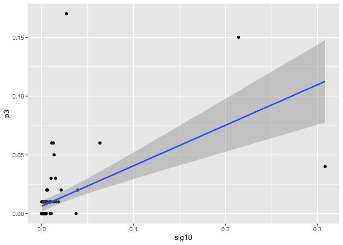

    data1 <- data %>%
      pivot_longer(
        cols = c(`sig10`, `sig6`, `sig1`),
        names_to = "signatures", 
        values_to = "prob"
      )

    #plot2
    ggplot(data1, aes(x = prob, y = p3, color = signatures)) +
      geom_point() +
      geom_smooth(method = "lm") +
      labs(
        y = "Mutation prob of P3",
        x = "Mutation prob of Sig",
        title = "Contribution of Signatures to the Profile P3"
      ) +
      theme(
            axis.text.x = element_text(color = "grey20", size = 17, angle = 0, hjust = 1, vjust = 0, face = "plain"), axis.text.y = element_text(color = "grey20", size = 17, angle = 0, hjust = 1, vjust = 0, face = "plain"), axis.title = element_text(size = 17), plot.title = element_text(size=22), legend.text=element_text(size=17), legend.title =element_text(size=17)) 

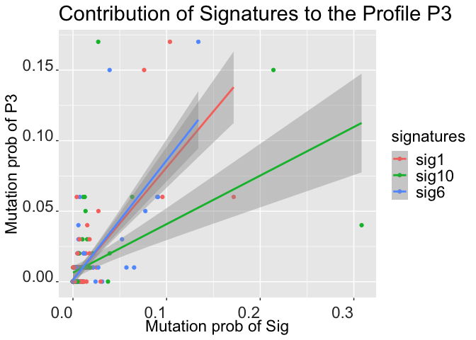

## Function for generating the sample mutation profiles

This function is for generating the sample profile with multiple
signatures.

    #sigs = the array of the signatures that we want to put 
    #nums = the number of mutations that we want to generate for each signature

    generate_sample_prof <- function(sigs, nums){
      
      cosmic.signatures <- get_known_signatures()
      sig <- cosmic.signatures[,sigs]
      
      #load the mutation order
      mut.selected <- sample.info %>%
        select (sample) %>%
        inner_join (signatures)
      
      mut.order="mutational_sig_oec/supplied_data/mut_sig.order.csv"
      mutational.signature <-  mut.selected
      mut_mat <-  read_csv(mut.order)
      
      mut.join <-  mutational.signature %>%
        inner_join(mut_mat)
      order.tri <-  unique(mut.join$ext.context)
      
      if(length(sigs) == 1){
        names(sig) <- order.tri
        sig <- as.matrix(sig)
        mut_order <- as_tibble(order.tri)
      } else{
        rownames(sig) <- order.tri
        mut_order <- as_tibble(order.tri)
      }
      
      df_a <- c()
      #generate from the first signature to the last signatures and merge with the first signature
      for (i in 1:length(sigs)){
        b <- sample(rownames(sig), size = nums[i], replace = TRUE, prob = sig[,i])
        df_b <- as_tibble(b)
        df_b <- df_b %>%
          count(value) %>%
          mutate(
            value = factor(value, levels = order.tri),
          ) %>%
          merge(mut_order, all = TRUE)
        
        df_b[is.na(df_b)] <- 0     # Replace NA with 0
        df_b <- df_b %>%
          select(-value)
        
        #rownames(df_b) <- order.tri
        df_b <- as.matrix(df_b)
        
        df_a <- cbind(df_a, df_b)
      }
      
      df_a <- rowSums(df_a)
      df_a <- as_tibble(df_a)
      colnames(df_a) <- c("mut")

      sample_profile <- df_a %>%
        mutate(
          prob = mut/sum(mut)
        )
      sample_profile <- as.matrix(sample_profile)
      rownames(sample_profile) <- order.tri
      
      sample_profile
    }

This function is plotting the sample mutational profile based on the
selected signatures and the number of mutations that we want to generate
for each signature.

    #sigs = the array of the signatures that we want to put 
    #nums = the number of mutations that we want to generate for each signature

    plot_sample_prof <- function(sample_profile){
      
      sample_profile <- sample_profile[,2]
      sample_profile <- as.matrix(sample_profile)
      colnames(sample_profile) <- c("prob")
      
      #plot the matrix or tibble
      plot_96_profile(sample_profile)
    }

## Linear Regression Model with constraints

The function **Dissolvo** generates the linear combination of the
selected multiple signatures with positive constraints for the generated
sample mutational profile.

    dissolvo <- function(sample_profile, sigs, tissue_type, scale, quantiles, mb_size){
      
      total_mut <- unname(colSums(sample_profile)[1])
      
      sample_profile <- as.matrix(sample_profile[,2])
      colnames(sample_profile) <- c("prob")

      #pulling constraints
      constraints_ds <- read_csv("Data/constraints_ds.csv")
      constr1 <- constraints_ds %>%
        filter(Tissue == tissue_type, Signature %in% sigs, Scale == scale, Quantile %in% quantiles) 
      constrs <- c(constr1$Value)
      
      #making dataset for the model
      cosmic.signatures <- get_known_signatures()
      sig <- cosmic.signatures[,sigs]
      
      df <- cbind(sample_profile,sig)
      if(length(sigs) == 1){
        colnames(df) <- c("prob", sigs)
      }
      df <- as_tibble(df)
      
      if(length(sigs) == 1){
        constraints <- str_c(constrs[1]*(mb_size/total_mut), ' < ', sigs[1], ', ', sigs[1], ' < ', constrs[2]*(mb_size/total_mut))
      } else{
            constraints <- str_c(constrs[1]*(mb_size/total_mut), ' < ', sigs[1], ', ', sigs[1], ' < ', constrs[2]*(mb_size/total_mut))
        for (i in 2:length(sigs)){
          constraint <- str_c(constrs[2*i-1]*(mb_size/total_mut), ' < ', sigs[i], ', ', sigs[i], ' < ', constrs[2*i]*(mb_size/total_mut))
          constraints <- str_c(constraints, ', ', constraint)
        }
      }
      
      model<- ConsReg(formula = prob ~ 0 + ., data = df,
                family = 'gaussian',
                constraints = constraints
                )
      
      model$coefficients
    }

**Dissolvo** testing code

    #1 sig
    sample_profile <- generate_sample_prof(c("SBS10a"),c(7000))
    plot_sample_prof(sample_profile)

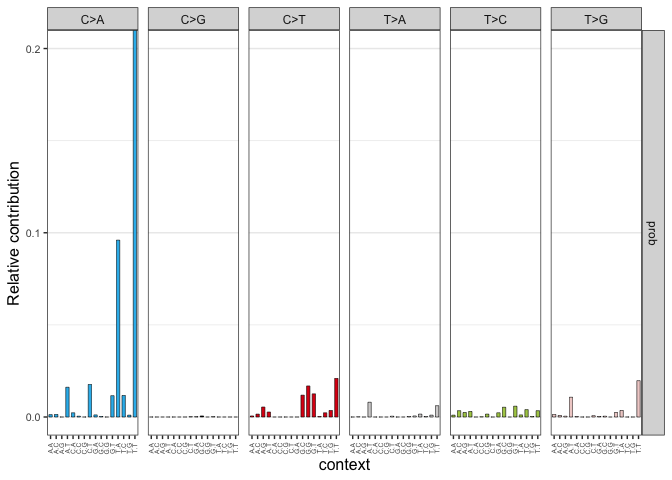

    dissolvo(sample_profile, sigs = c("SBS10a"), tissue_type = "COAD", scale = "exome", quantiles = c("5%", "95%"), mb_size = 50)

    ## 
    ## Iter: 1 fn: 0.0000001769  Pars:  0.99474
    ## solnp--> Completed in 1 iterations

    ##    SBS10a 
    ## 0.9947394

    #2 sigs
    sample_profile <- generate_sample_prof(c("SBS10a","SBS6"),c(3000,7000))
    plot_sample_prof(sample_profile)

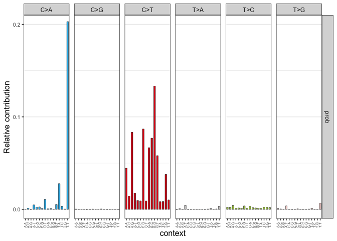

    dissolvo(sample_profile, sigs = c("SBS10a","SBS6"), tissue_type = "COAD", scale = "exome", quantiles = c("5%", "95%"), mb_size = 50)

    ## 
    ## Iter: 1 fn: 1000.0000     Pars:  0.30192 0.70326
    ## solnp--> Completed in 1 iterations

    ##    SBS10a      SBS6 
    ## 0.3019197 0.7032611

    #3 sigs
    sample_profile <- generate_sample_prof(c("SBS1","SBS10b","SBS6"),c(200,300,500))
    plot_sample_prof(sample_profile)

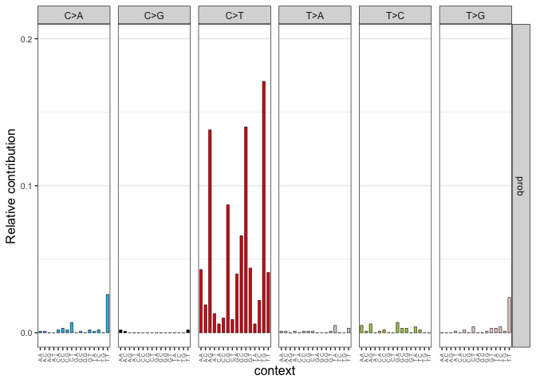

    dissolvo(sample_profile, sigs = c("SBS1","SBS10b","SBS6"), tissue_type = "COAD", scale = "exome", quantiles = c("40%", "50%"), mb_size = 50)

    ## 
    ## Iter: 1 fn: 1000.0000     Pars:  0.20102 0.28355 0.49638
    ## solnp--> Completed in 1 iterations

    ##      SBS1    SBS10b      SBS6 
    ## 0.2010162 0.2835543 0.4963796

    #4 sigs
    sample_profile <- generate_sample_prof(c("SBS10a","SBS10b","SBS1","SBS6"),c(300,100,200,400))
    plot_sample_prof(sample_profile)

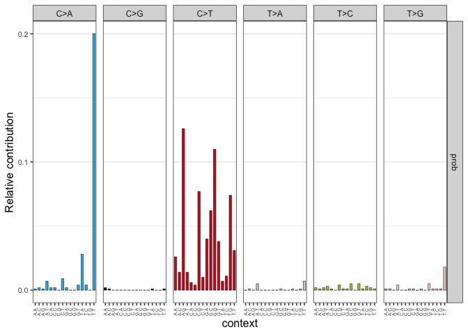

    dissolvo(sample_profile, sigs = c("SBS10a","SBS10b","SBS1","SBS6"), tissue_type = "COAD", scale = "exome", quantiles = c("5%", "95%"), mb_size = 50)

    ## 
    ## Iter: 1 fn: 1000.0000     Pars:  0.28909 0.08402 0.17692 0.41176
    ## solnp--> Completed in 1 iterations

    ##     SBS10a     SBS10b       SBS1       SBS6 
    ## 0.28908602 0.08401502 0.17692219 0.41176308

    #5 sigs
    sample_profile <- generate_sample_prof(c("SBS10a","SBS10b","SBS1","SBS6", "SBS2"),c(200,300,100,300,100))
    plot_sample_prof(sample_profile)

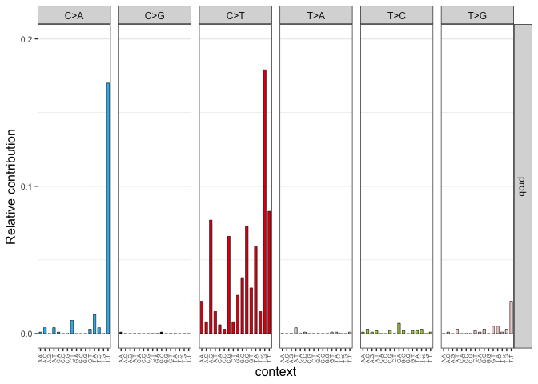

    dissolvo(sample_profile, sigs = c("SBS10a","SBS10b","SBS1","SBS6", "SBS2"), tissue_type = "COAD", scale = "exome", quantiles = c("5%", "95%"), mb_size = 50)

    ## 
    ## Iter: 1 fn: 1000.0000     Pars:  0.21119 0.32877 0.12554 0.25788 0.10191
    ## solnp--> Completed in 1 iterations

    ##    SBS10a    SBS10b      SBS1      SBS6      SBS2 
    ## 0.2111927 0.3287712 0.1255408 0.2578841 0.1019070

## Evaluation of **Dissolvo** for ColoRect Cancer

    COSMICsample_ds <- read_csv("Data/COSMICsample_ds.csv")
    cosmic.signatures <- get_known_signatures()
    tissue_list <- unique(COSMICsample_ds$Cancer.Types)

These are the signatures that the constraints are unknown in the COSMIC
website.

    COSMICsample <- COSMICsample_ds %>%
      select(6:68) 
    signature_list <- colnames(COSMICsample)
    signature_list <- str_remove(signature_list, ".Mutations")
    cosmic_signature_list <- colnames(cosmic.signatures)

    known_sig <- signature_list[signature_list %in% cosmic_signature_list]

    coloE_samples <- COSMICsample_ds %>%
      filter(Cancer.Types == "ColoRect-AdenoCA") %>%
      filter(Scale == "exome")

    coloE_samples_withnames <- coloE_samples %>%
      select(4,6:68)
    coloE_samples <- coloE_samples %>%
      select(6:68) 
    coloE_size <- dim(coloE_samples)[1]

    sample_names_list <- coloE_samples_withnames %>%
        select(1)
    sample_names_list <- as.matrix(sample_names_list)

This chunk is making the final dataframe for the evaluation of the
method. We are going to comapre the coefficients from **Dissolvo**,
**fit\_to\_signature** function from MutationalPatterns library, and the
true proportion.

    actual_list <- c()
    expected_list <- c()
    fitsig_list <- c()
    sig_list <- c()
    sample_list <- c()

    for (i in 1:coloE_size){
      
      mut <- as.numeric(coloE_samples[i,])
      nonzero_sig <- (which(mut %nin% c(0, NA)))
      list <- colnames(coloE_samples)
      s_list <- list[nonzero_sig]
      s_list <- str_remove(s_list, ".Mutations")
      m_list <- mut[mut %nin% c(0, NA)]
      
      bool <- s_list %in% known_sig
      s_list <- s_list[bool]
      m_list <- m_list[bool]
      
      if(length(m_list) == 1){
        next
      }
      
      prop.test <- prop.table(m_list)
      
      neg_count <- 1
      while(neg_count != 0){
        sample_prof <- generate_sample_prof(s_list, m_list)
        model <- dissolvo(sample_prof, sigs = s_list, tissue_type = "COAD", scale = "exome", quantiles = c("5%","95%"), mb_size = 50)
        coeff_list <- unname(model)
        neg_count <- sum(coeff_list < 0)
      }
      method_test <- model

      fit_test <- fit_to_signatures(sample_prof, cosmic.signatures[,s_list])
      fit_test <- fit_test$contribution[,2]
      
      sample_names <- c()
      for(j in 1:length(s_list)){
        sample_name <- sample_names_list[i]
        sample_names <- append(sample_names, sample_name)
      }
      
      sample_list <- append(sample_list, sample_names)
      actual_list <- append(actual_list, prop.test)
      expected_list <- append(expected_list, method_test)
      fitsig_list <- append(fitsig_list, fit_test)
      sig_list <- append(sig_list, s_list)
    }

    eval_df <- cbind(sample_list, sig_list, expected_list, fitsig_list, actual_list)
    eval_df <- as_tibble(eval_df)
    eval_df <- eval_df %>%
      mutate(
        expected_list = as.numeric(expected_list),
        fitsig_list = as.numeric(fitsig_list),
        actual_list = as.numeric(actual_list)
      )

    #write.csv(eval_df, "Data/colorect_cancer_evaluation.csv", row.names = FALSE)

## Result Figures - Plot the Expected vs. Actual

This plot is comparing the result from **Dissolve**(Expected) and the
true proportion(Actual).

    eval_df <- read_csv("Cancer_Evaluation/Cancer_Evaluation_Data/colorect_cancer_evaluation.csv")

    #Result Figure1
    ggplot(data = eval_df, aes(x = expected_list, y = actual_list))+
       geom_point(alpha=0.3) +
       geom_smooth(method = "lm") +
       labs(x = "Expected Value", y = "Actual Value")

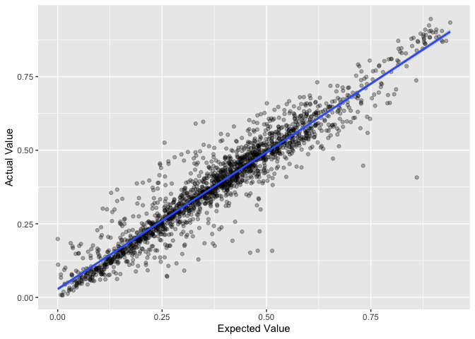

    cor(eval_df$expected_list, eval_df$actual_list)

    ## [1] 0.9506166

    cor(eval_df$fitsig_list, eval_df$actual_list)

    ## [1] 0.9506166

    sig_levels <- c("SBS1", "SBS5", "SBS15", "SBS40", "SBS44")
    eval_df2 <- eval_df %>%
      mutate(sig_list = factor(sig_list, sig_levels)) %>%
      group_by(sig_list) %>%
      mutate(n = n()) %>%
      filter(n > 65 & !is.na(sig_list))

    #Result Figure2
    ggplot(data = eval_df2, aes(x = expected_list, y = actual_list))+
       geom_point(alpha=0.3) +
       geom_smooth(method = "lm") +
       facet_wrap(~sig_list) +
       labs(x = "Expected Value", y = "Actual Value")

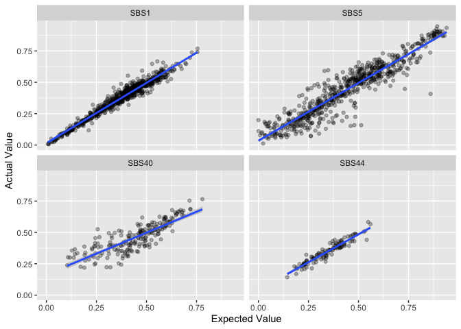

    #Correlation of each signature
    sbs1 <- eval_df2 %>%
      filter(sig_list == "SBS1")
    cor(sbs1$expected_list, sbs1$actual_list)

    ## [1] 0.9775096

    sbs5 <- eval_df2 %>%
      filter(sig_list == "SBS5")
    cor(sbs5$expected_list, sbs5$actual_list)

    ## [1] 0.9360329

    sbs40 <- eval_df2 %>%
      filter(sig_list == "SBS40")
    cor(sbs40$expected_list, sbs40$actual_list)

    ## [1] 0.8312894

    sbs44 <- eval_df2 %>%
      filter(sig_list == "SBS44")
    cor(sbs44$expected_list, sbs44$actual_list)

    ## [1] 0.9489562

The correlation between **Dissolvo** and true proportion for Colorectal
cancer is around 95%. The correlation between **Dissolvo** and true
proportion for Colorectal cancer is the most accurate as about 97.8% in
SBS1. SBS5 is 93.6%, SBS40 is 83.1%, SBS44 is 94.9%. Dissolvo is less
effective in SBS40 compared to the other mutational signatures.

This plot is comparing the result from **Dissolvo**(Expected) and the
**fit\_to\_signature** function from MutationalPatterns library.

    ggplot(data = eval_df, aes(x = expected_list, y = fitsig_list))+
       geom_point(alpha=0.3) +
       geom_smooth(method = "lm") +
       labs(x = "Expected Value", y = "fit_to_sig Value")

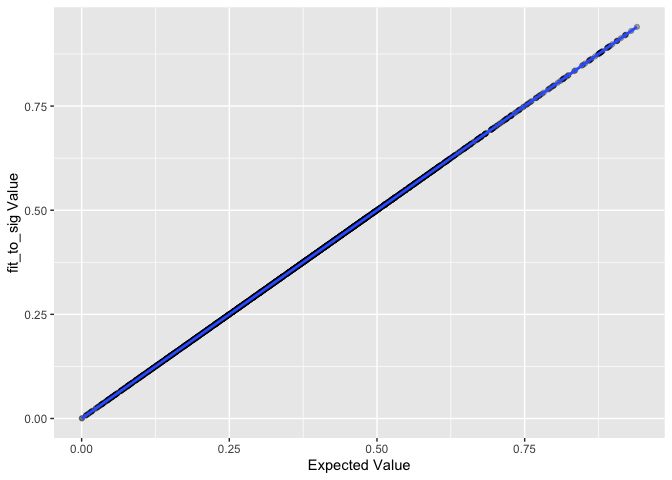

    ggplot(data = eval_df, aes(x = expected_list, y = fitsig_list))+
       geom_point(alpha=0.3) +
       geom_smooth(method = "lm") +
       facet_wrap(~sig_list) +
       labs(x = "Expected Value", y = "fit_to_sig Value")

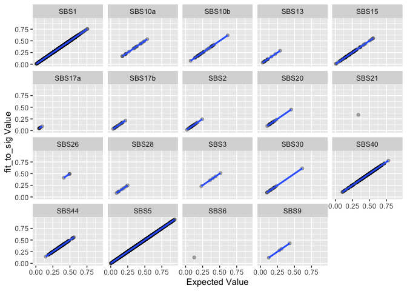

    cor(eval_df$expected_list, eval_df$fitsig_list)

    ## [1] 1

As the result above, **Dissolvo** and **fit\_to\_signature** have almost
the same result, so **Dissolvo** has no big advantage over
**fit\_to\_signature**.

This plot is for all three options together.

    eval_df_plot <- eval_df %>%
      pivot_longer(
        cols = c(`expected_list`, `fitsig_list`),
        names_to = "method", 
        values_to = "coeff", 
        values_drop_na = TRUE
      )

    ggplot(eval_df_plot, aes(actual_list, coeff, colour = method)) +
       geom_point(alpha=0.3) +
       geom_smooth(method = "lm") +
       labs(x = "Truth")

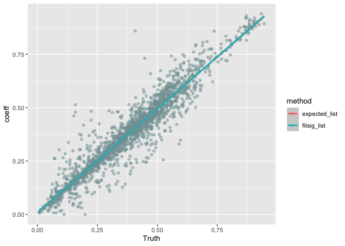

    ggplot(eval_df_plot, aes(actual_list, coeff, colour = method)) +
       geom_point(alpha=0.3) +
       geom_smooth(method = "lm") +
       facet_wrap(~sig_list) +
       labs(x = "Truth")

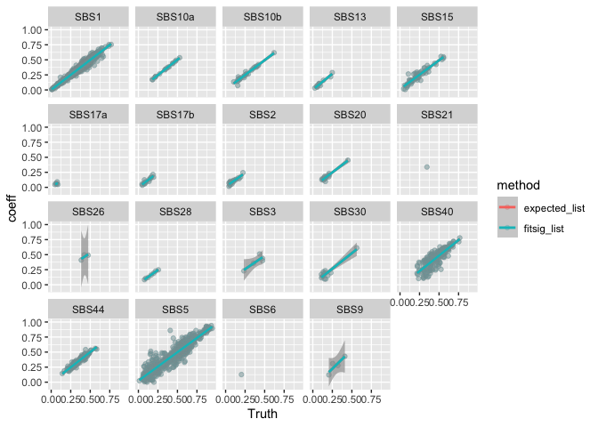

    histogram(eval_df$fitsig_list-eval_df$actual_list)

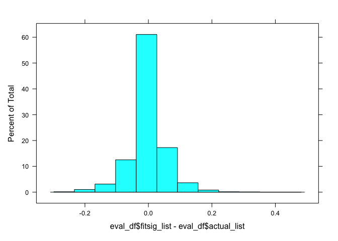

    histogram(eval_df$expected_list-eval_df$actual_list)

    mosaic::fav_stats(eval_df$fitsig_list-eval_df$actual_list)

    ##         min          Q1        median         Q3       max         mean
    ##  -0.2694605 -0.02513294 -0.0008797134 0.02179531 0.4526053 -0.001477582
    ##          sd    n missing
    ##  0.05755254 1947       0

    mosaic::fav_stats(eval_df$expected_list-eval_df$actual_list)

    ##         min          Q1        median         Q3       max         mean
    ##  -0.2694605 -0.02513294 -0.0008797134 0.02179531 0.4526053 -0.001477582
    ##          sd    n missing
    ##  0.05755254 1947       0

Getting MSE between **Dissolvo**(Expected) vs. **fit\_to\_signature**
vs. True proportion(Actual)

    mse_list_EF <- c()
    mse_list_EA <- c()

    for (i in 1:coloE_size){
      
      mut <- as.numeric(coloE_samples[i,])
      nonzero_sig <- (which(mut %nin% c(0, NA)))
      list <- colnames(coloE_samples)
      s_list <- list[nonzero_sig]
      s_list <- str_remove(s_list, ".Mutations")
      m_list <- mut[mut %nin% c(0, NA)]
      
      bool <- s_list %in% known_sig
      s_list <- s_list[bool]
      m_list <- m_list[bool]
      
      if(length(m_list) == 1){
        next
      }
      
      prop_test <- prop.table(m_list)
      
      neg_count <- 1
      while(neg_count != 0){
        sample_prof <- generate_sample_prof(s_list, m_list)
        model <- dissolvo(sample_prof, sigs = s_list, tissue_type = "COAD", scale = "exome", quantiles = c("5%","95%"), mb_size = 50)
        coeff_list <- unname(model)
        neg_count <- sum(coeff_list < 0)
      }
      method_test <- model
      
      fit_test <- fit_to_signatures(sample_prof, cosmic.signatures[,s_list])
      fit_test <- fit_test$contribution[,2]
      
      df <- cbind(fit_test, method_test)
      df <- as_tibble(df)
      mse <- rmse_vec(df$fit_test, df$method_test)^2
      mse_list_EF <- append(mse_list_EF, mse)

      df <- cbind(prop_test, method_test)
      df <- as_tibble(df)
      mse <- rmse_vec(df$prop_test, df$method_test)^2
      mse_list_EA <- append(mse_list_EA, mse)
    }

    coloE_sample_names <- unique(eval_df$sample_list)
    mse_df <- cbind(coloE_sample_names, mse_list_EF, mse_list_EA)
    mse_df <- as_tibble(mse_df)
    mse_df <- mse_df %>%
      mutate(
        mse_list_EF = as.numeric(mse_list_EF),
        mse_list_EA = as.numeric(mse_list_EA)
      )

    #write.csv(mse_df, "Data/colorect_mse_ds.csv", row.names = FALSE)

Plot of MSE between **Dissolvo**(Expected) vs. **fit\_to\_signature**
vs. True proportion(Actual)

    mse_df <- read_csv("Data/colorect_mse_ds.csv")

    mean(mse_df$mse_list_EA)

    ## [1] 0.003697565

    mean(mse_df$mse_list_EF)

    ## [1] 5.060766e-23

    histogram(mse_df$mse_list_EA)

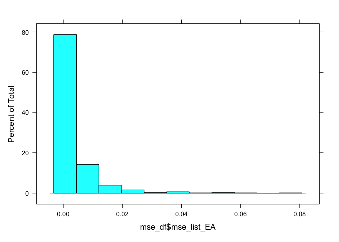

    histogram(mse_df$mse_list_EF)

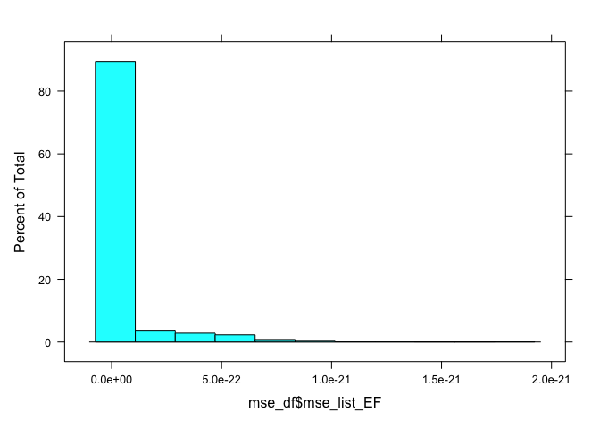

    mse_df %>%
      ggplot(aes(x = seq(1, dim(mse_df)[1]), y = mse_list_EA)) +
        geom_point() +
        labs(x = "samples", y = "MSE", title = "MSE between Expected and Actual value") 

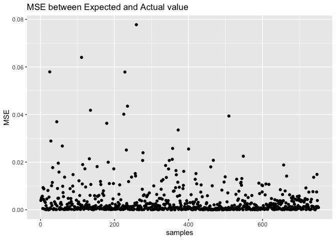

    mse_df %>%
      ggplot(aes(x = seq(1, dim(mse_df)[1]), y = mse_list_EF)) +
        geom_point() +
        labs(x = "samples", y = "MSE", title = "MSE between Expected and fit_to_signature value") 

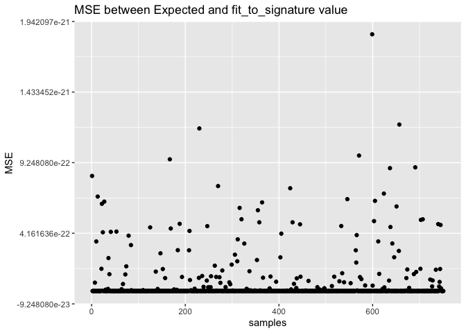
